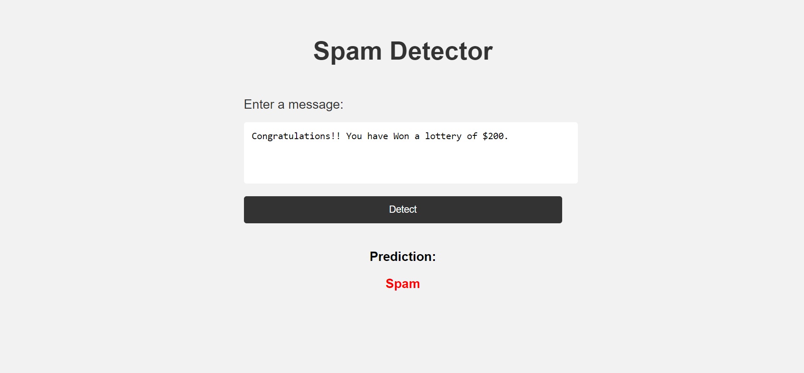
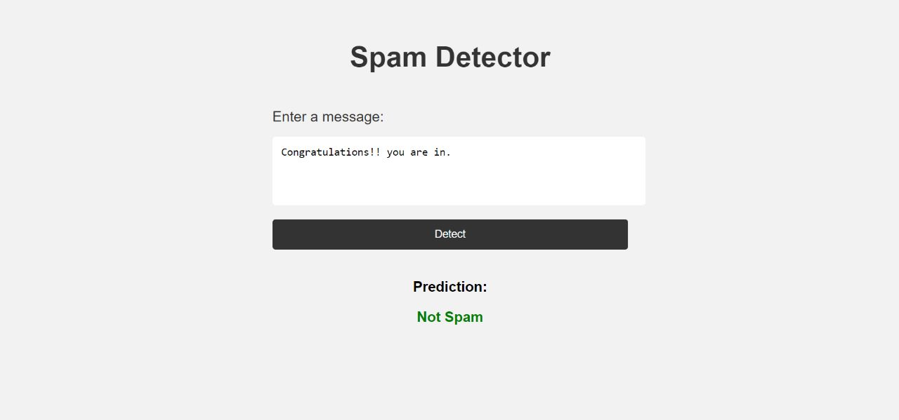

# Spam-Classifier
Spam Classifier which Classifies if the given message is spam or not spam.
Tried Various Machine learning algorithms such as Support Vector Machines, K-Nearest Neighbours , Random Forest, Naive Bayes Theorem , etc.
Bag of Words and TFIDF was used for Feature Extraction.
Finally, Used FastAPI to deploy the Model.

